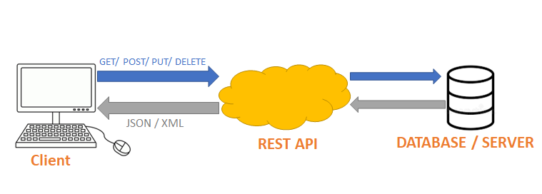

### API stands for:

- Application Programming Interface. APIs are used to facilitate communication between different software applications.
  They are popular because they allow developers to easily share and access data and functionality across different
  platforms and devices.

### API Diagram

### A REST API:
- is a type of API that adheres to the principles of Representational State Transfer (REST). A RESTful API is designed
  to be scalable, flexible, and easy to use. It uses HTTP requests to access and manipulate data, and typically returns
  data in JSON or XML format.

### HTTP stands for:

- Hypertext Transfer Protocol. It is a protocol used for transmitting data over the internet. It is used to facilitate
  communication between web servers and web clients, such as web browsers.

### HTTP Request Structure:

- Request Line (e.g. GET /index.html HTTP/1.1)
- Headers (e.g. User-Agent, Accept, Content-Type)
- Body (optional, e.g. form data or JSON payload)

### HTTP Response Structure:

- Status Line (e.g. HTTP/1.1 200 OK)
- Headers (e.g. Content-Type, Content-Length)
- Body (optional, e.g. HTML or JSON data)

### The 5 HTTP verbs are:

- GET: retrieves data from a server
- POST: submits data to be processed by a server
- PUT: updates existing data on a server
- PATCH: modifies existing data on a server
- DELETE: deletes data from a server

### Statelessness refers to:

- the design principle of not maintaining any client state on the server. In other words, each request from the client
  to the server must contain all of the necessary information for the server to fulfill the request, without relying on
  any previous requests or sessions.

### Caching:

- process of storing frequently accessed data in a cache so that it can be quickly retrieved when needed. This can
  improve the performance and speed of web applications by reducing the number of requests that need to be made to the
  server.